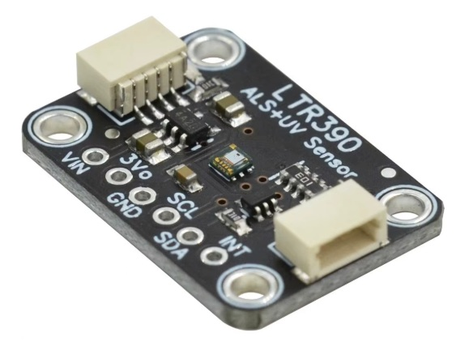

# LTR390 UV Sensor with I2C Interface

Soldering the tiny ant-sized LTR390 chip is almost impossible, so the Adafruit breakout board was used.



The Adafruit library does not contain the LUX and UV Index calculations, and it requires the Adafruit BusIO library which makes the code much bigger.

This stand-alone mumanchu class has integer and/or float for LUX and UV Index calculations.

The LTR390 has two sensors, an ambient light sensor (ALS) and a UV sensor (UVS). Only one sensor can be active at a time, selected by `setSensor()`.

Use `setConfiguration()` to configure the sensor's resolution (in bits), sample rate and the gain (1..18). For high LUX levels, a high gain may cause overflow. Reduce the gain for high light levels, increase the gain for low light levels. TODO: You could add an auto-gain-adjust feature.

Either floating point and/or integer calculations for the LUX and UV Index values can be done. Add `#define LTR390_FLOAT` or `%define LTR390_INT` before `#include "LTR390UVSensor.h"` to select only float or only integer calculations. If neither is defined it uses both versions by default. Using floating point is slower and increases the code size if you are not using floats elsewhere, but float is needed for measuring light levels below 1 LUX.

Note that the green Power LED on the Adafruit board can add a few LUX to very low light readings, so stick some black tape over the Power LED.

A nasty problem was found. The 'software reset' command can hang the I2C bus because the LTR390 does not issue the I2C ACK. This is handled by special code in `begin()`.


## LTR390UVSensor Class Reference

Details of each method can be found in the source code's comments, or just by reading the simple C++ code in `LTR390UVSensor.h`.

All methods return `true` on success or `false` if communications or validation failed. Data is always returned via parameter pointers (do not use `NULL` pointers).

To use only float calculations, define `LTR390_FLOAT` before including `LTR390UVSensor.h`. To use only integer calculations, define `LTR390_INT`. If neither is defined then it uses both versions by default.

If your sensor has a glass or plastic cover, set the 'window factor' `wfac` to > 1.0 to compensate for the light reduction. This must be found by calibration (compare values with/without the widow). For float calculations, set `wfacF`. For integer calculations, set `wfacI` to 'wfac x 1000'

```cpp
class LTR390UVSensor
{
public:
	#ifdef LTR390_FLOAT
	// for float calculation
	// wfac : 1.0 for no window/glass
	//       >1.0 for device under tinted glass (needs calibration)
	float wfacF = 1.0f;
	#endif
	#ifdef LTR390_INT
	// for integer calculation
	// wfac x 1000 : e.g. 1.0 = 1000, 1.234 = 1234, 1.5 = 1500
	ulong wfacI = 1000;
	#endif

	typedef enum {
		ALS = 0,	// ambient light sensor channel
		UVS = 1		// uv sensor channel
	} CHANNEL;

	bool begin(TwoWire* twoWire, byte i2cAddress);
	bool reset();
	bool getID(uint* partNumber, uint* revisionId);
	bool setConfiguration(uint resolution, uint sampleRate, uint gain);
	bool getConfiguration(uint* resolution, uint* sampleRate, uint* gain);
	bool configureIntPin(CHANNEL channel, uint persistence);
	bool enableIntPin(bool enable);
	bool setIntPinThreshold(ulong upperThreshold, ulong lowerThreshold);
	bool setChannel(CHANNEL channel);
	bool getChannel(CHANNEL* channel);
	bool enableSensor(bool enable);
	bool getStatus(bool* dataReady, bool* intTriggered = NULL, bool* powerOn = NULL);
	bool getReading(CHANNEL channel, ulong* reading);
	#ifdef LTR390_FLOAT
	float calculateLuxF(ulong alsReading);
	uint calculateUVIndexF(ulong uvsReading);
	#endif
	#ifdef LTR390_INT
	ulong calculateLuxI(ulong alsReading);
	uint calculateUVIndexI(ulong uvsReading);
	#endif
}
```

## Example Sketch

The example selects either the Abient Light sensor (ALS) or the UV sensor (UVS) (patch code as approriate), then cycles through the gains and resolutions so you can see the effects (patch code as appropriate). For bright light, you will get ALS overflow for high gains, overflow returns 999999 LUX. Thankfully, I've never managed to overflow the UV Index.

## I2C Address

The I2C address is fixed at 0x53.

## Missing Links

LTR390 DATA SHEET \
https://optoelectronics.liteon.com/upload/download/DS86-2015-0004/LTR-390UV_Final_%20DS_V1%201.pdf

ADAFRUIT LTR390 BREAKOUT BOARD \
https://learn.adafruit.com/adafruit-ltr390-uv-sensor

ADAFRUIT LTR390 LIBRARY, for reference \
https://github.com/adafruit/Adafruit_LTR390

## Revision History

| Date  | Revision | Description |
|:---------- |:---------|:----------- |
| 2026.08.25 | 0.0.0	| Preliminary |

<br/>

## Question of the Week

_Does darkness travel faster than light?_


